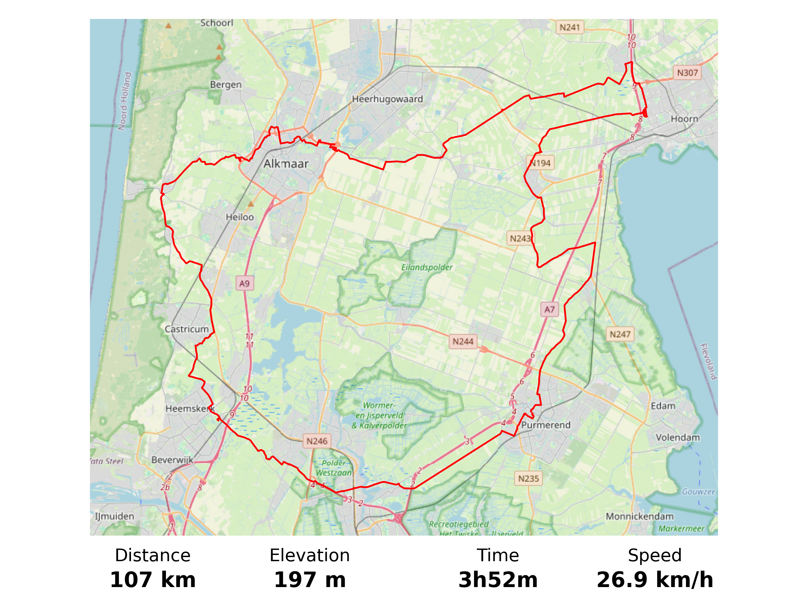

# map_tools
Produces map movies and plots from GPS routes (.gpx format). Maps come from OpenStreetMap.

<table>
  <tr>
    <td colspan="2"></td>
  </tr>
 </table>

## Instructions
- Adapt the config in config.yaml; in particular edit the ffmpeg executable path to your local file.
- Add your route in .gpx format to the route_files folder.
- Edit main.py to load your route file and create a movie from it.
- Run main.py.

## TODO:
- join .gpx routes using +.
- refactor delta_if_centered to a more readable parameter set.
- refactor into proper python package.
- automatic tests with Github Actions.