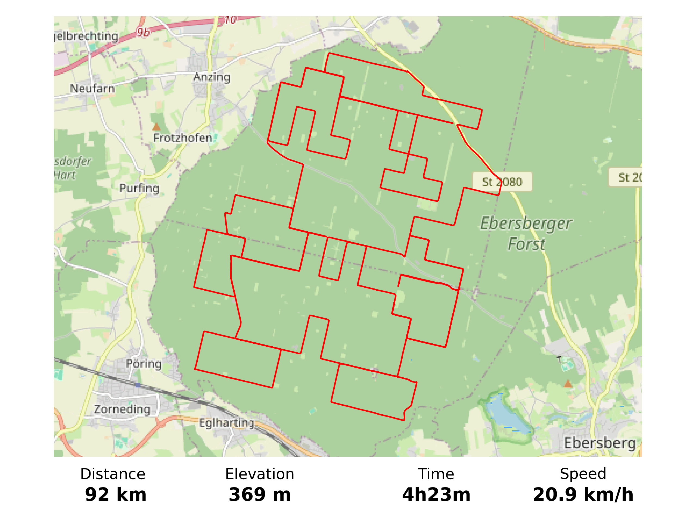

# map_tools
Produces map movies and plots from GPS routes (.gpx format). Maps come from OpenStreetMap.

Examples:
<table>
  <tr>
    <td colspan="2"></td>
  </tr>
 </table>
<table>
  <tr>
    <td colspan="2"></td>
  </tr>
 </table>

## Instructions
- Install the required packages (see setup.py) and ffmpeg.
- Adapt the config in config.yaml, in particular the ffmpeg executable path.
- Add your route in .gpx format to the route_files folder.
- Edit example.py to load your route file and create a movie from it.
- Run example.py.
